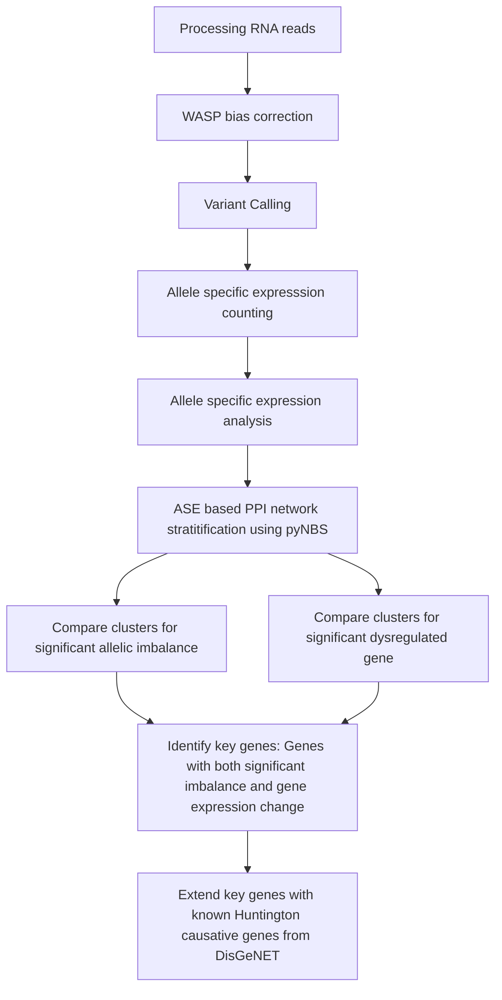

## Docker Images

Pre-built Docker images are available on Docker Hub:

| Environment | Tool | Pull Command |
|-------------|------|-------------|
| STAR | RNA-seq alignment | `docker pull ashviyer/hd-ase-star` |
| GATK | Variant calling | `docker pull ashviyer/hd-ase-gatk` |
| featureCounts | Read counting | `docker pull ashviyer/hd-ase-featurecount` |
| RSeQC | QC analysis | `docker pull ashviyer/hd-ase-rseqc` |
| pyNBS | Network clustering | `docker pull ashviyer/hd-ase-pynbs` |

### Run interactively:
docker run -it ashviyer/hd-ase-star

    ## Pipeline

| Step | Script | Environment | Input | Output |
|------|--------|-------------|-------|--------|
| 1. Alignment | `scripts/align.sh` | `star_env` | FASTQ | BAM |
| 2. QC | `scripts/qc.sh` | `rseqc_env` | BAM | QC report |
| 3. Read counting | `scripts/featurecount.sh` | `featureCount_env` | BAM | Count matrix |
| 4. Diff. expression | `scripts/deseq2.R` | `r_env` | Count matrix | DE genes |
| 5. Variant calling | `scripts/gatk.sh` | `gatk_env` | BAM | VCF |
| 6. Network clustering | `scripts/pynbs_parallel.py` | `pynbs_env` | Mutation matrix | Clusters |
| 7. Visualisation | `scripts/plots.R` | `r_env` | DE genes + Clusters | Figures |
