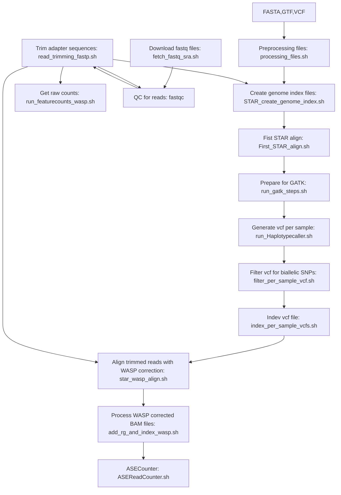

```mermaid
flowchart TD
    A[FASTA,GTF,VCF] --> B[Preprocessing files: processing_files.sh]
    B --> C[Create genome index files: STAR_create_genome_index.sh]
    C --> D[Fist STAR align: First_STAR_align.sh]
    D --> E[Prepare for GATK: run_gatk_steps.sh]
    E --> F[Generate vcf per sample: run_Haplotypecaller.sh]
    F --> G[Filter vcf for biallelic SNPs: filter_per_sample_vcf.sh]
    G --> H[Indev vcf file: index_per_sample_vcfs.sh]
    H --> I[Align trimmed reads with WASP correction: star_wasp_align.sh]
    I --> J[Process WASP corrected BAM files: add_rg_and_index_wasp.sh]
    O --> K[Get raw counts: run_featurecounts_wasp.sh]
    J --> L[ASECounter: ASEReadCounter.sh]
    M[Download fastq files: fetch_fastq_sra.sh] --> N[QC for reads: fastqc]
    N --> O[Trim adapter sequences: read_trimming_fastp.sh]
    O --> N
    O --> I[Align trimmed reads with WASP correction: star_wasp_align.sh]
    O --> C[Create genome index files: STAR_create_genome_index.sh]
```

